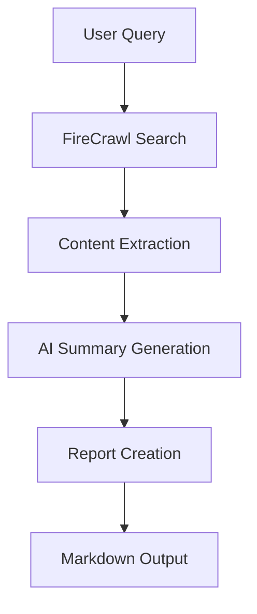

# 🔥 FireCrawl Learning Course & Flow Project

This repository contains a comprehensive collection of FireCrawl examples, from basic scraping to advanced AI-powered web crawling flows. It demonstrates the progression from simple API calls to sophisticated multi-agent systems that can search, scrape, analyze, and generate reports.

## 📚 Table of Contents

- [🔥 FireCrawl Learning Course \& Flow Project](#-firecrawl-learning-course--flow-project)
  - [📚 Table of Contents](#-table-of-contents)
  - [🚀 Quick Start](#-quick-start)
  - [📖 Basic Examples (01-12)](#-basic-examples-01-12)
    - [01. Synchronous Scraper (`01_synch_scraper.py`)](#01-synchronous-scraper-01_synch_scraperpy)
    - [02. Asynchronous Scraper (`02_async_scraper.py`)](#02-asynchronous-scraper-02_async_scraperpy)
    - [03. Scraping with Parameters (`03_scrape_with_params.py`)](#03-scraping-with-parameters-03_scrape_with_paramspy)
    - [04. Basic Crawling (`04_crawl.py`)](#04-basic-crawling-04_crawlpy)
    - [05. Asynchronous Crawling (`05_async_crawl.py`)](#05-asynchronous-crawling-05_async_crawlpy)
    - [06. LLMs.txt Generation (`06_llmstext.py`)](#06-llmstxt-generation-06_llmstextpy)
    - [07. Website Mapping (`07_map.py`)](#07-website-mapping-07_mapyy)
    - [08. Data Extraction (`08_extract.py`)](#08-data-extraction-08_extractpy)
    - [09. Async Data Extraction (`09_extract_async.py`)](#09-async-data-extraction-09_extract_asyncpy)
    - [10. Web Search (`10_search.py`)](#10-web-search-10_searchpy)
    - [11. Agent-Based Scraping (`11_fire_agent.py`)](#11-agent-based-scraping-11_fire_agentpy)
  - [🤖 Advanced Flow Project (`firecrawl_flow/`)](#-advanced-flow-project-firecrawl_flow)
    - [Features](#features)
    - [Architecture](#architecture)
    - [Project Structure](#project-structure)
    - [Installation \& Setup](#installation--setup)
    - [Usage](#usage)
    - [Output Example](#output-example)
  - [🛠️ Utility Scripts](#️-utility-scripts)
    - [LLMs Status Checker (`get_llms_status.py`)](#llms-status-checker-get_llms_statuspy)
  - [⚙️ Environment Setup](#️-environment-setup)
  - [📋 Prerequisites](#-prerequisites)
  - [🔑 API Key Configuration](#-api-key-configuration)
  - [🚀 Running the Examples](#-running-the-examples)
  - [📈 Learning Path](#-learning-path)
  - [🤝 Contributing](#-contributing)
  - [📄 License](#-license)

## 🚀 Quick Start

1. **Clone the repository**
2. **Set up environment**:
   ```bash
   python -m venv venv
   source venv/bin/activate  # On Windows: venv\Scripts\activate
   pip install -r requirements.txt
   ```
3. **Configure API key**:
   ```bash
   cp .env.example .env
   # Add your FIRECRAWL_API_KEY to .env
   ```
4. **Run basic example**:
   ```bash
   python 01_synch_scraper.py
   ```
5. **Try the advanced flow**:
   ```bash
   cd firecrawl_flow
   crewai run
   ```

## 📖 Basic Examples (01-12)

### 01. Synchronous Scraper (`01_synch_scraper.py`)
**Purpose**: Basic website scraping with FireCrawl  
**Features**:
- Simple synchronous scraping
- Extracts markdown and HTML formats
- Displays metadata (title, description, credits used)
- Shows content preview

**Use Case**: Perfect starting point for understanding FireCrawl basics

---

### 02. Asynchronous Scraper (`02_async_scraper.py`)
**Purpose**: Demonstrates asynchronous scraping capabilities  
**Features**:
- Async batch scraping
- Non-blocking operations
- Better performance for multiple URLs

**Use Case**: When you need to scrape multiple sites efficiently

---

### 03. Scraping with Parameters (`03_scrape_with_params.py`)
**Purpose**: Advanced scraping with structured data extraction  
**Features**:
- Pydantic schema-based extraction
- JSON configuration
- Structured data output for complex websites
- Extracts specific business information (SSO, pricing, etc.)

**Use Case**: Extracting structured business data from company websites

---

### 04. Basic Crawling (`04_crawl.py`)
**Purpose**: Website crawling to discover and scrape multiple pages  
**Features**:
- Crawls entire websites
- Configurable page limits
- Saves results to JSON
- Multiple format support

**Use Case**: Building sitemaps or comprehensive website analysis

---

### 05. Asynchronous Crawling (`05_async_crawl.py`)
**Purpose**: Non-blocking website crawling with status monitoring  
**Features**:
- Async crawl job management
- Real-time status checking
- Polling mechanism for job completion

**Use Case**: Large-scale website crawling without blocking your application

---

### 06. LLMs.txt Generation (`06_llmstext.py`)
**Purpose**: Generate LLM-friendly documentation from websites  
**Features**:
- Creates machine-readable content for AI models
- Standardized llms.txt format
- Full text extraction option

**Use Case**: Preparing website content for AI model training or analysis

---

### 07. Website Mapping (`07_map.py`)
**Purpose**: Discover all available pages on a website  
**Features**:
- URL discovery
- Subdomain inclusion
- Page counting
- Sitemap generation

**Use Case**: Website auditing and content inventory

---

### 08. Data Extraction (`08_extract.py`)
**Purpose**: AI-powered data extraction from multiple sources  
**Features**:
- Multi-URL extraction
- Custom prompts for extraction
- Schema-based structured output
- Company information extraction

**Use Case**: Competitive analysis and market research

---

### 09. Async Data Extraction (`09_extract_async.py`)
**Purpose**: Asynchronous AI-powered extraction with job management  
**Features**:
- Async extraction jobs
- Status monitoring
- Job queue management
- Company mission and feature extraction

**Use Case**: Large-scale data extraction projects

---

### 10. Web Search (`10_search.py`)
**Purpose**: Search the web and extract content from results  
**Features**:
- Web search integration
- Content extraction from search results
- Time-based filtering (recent results)
- Multiple format support

**Use Case**: Research and content discovery

---

### 11. Agent-Based Scraping (`11_fire_agent.py`)
**Purpose**: AI agent-powered interactive scraping  
**Features**:
- FIRE-1 model integration
- Interactive navigation
- Custom agent prompts
- Dynamic page interaction

**Use Case**: Scraping dynamic websites requiring user interaction

---

### 12. Advanced Agent (`12_agent.py`)
**Purpose**: (Empty file - placeholder for future advanced agent features)  
**Status**: Template for custom agent implementations

---

## 🤖 Advanced Flow Project (`firecrawl_flow/`)

The `firecrawl_flow` project is a sophisticated CrewAI-based system that combines web search, scraping, AI analysis, and report generation into a seamless workflow.

### Features

- 🔍 **Intelligent Web Search**: Uses FireCrawl's search capabilities to find relevant content
- 📄 **Content Extraction**: Scrapes and extracts content from search results
- 🤖 **AI-Powered Analysis**: Employs AI agents to analyze and summarize content
- 📊 **Rich Report Generation**: Creates comprehensive markdown reports with insights
- 🔄 **Flow-Based Architecture**: Uses CrewAI Flow for orchestrating the entire pipeline

### Architecture



### Project Structure

```
firecrawl_flow/
├── src/
│   └── firecrawl_flow/
│       ├── main.py              # Main flow orchestration
│       ├── models.py            # Pydantic data models
│       ├── utils/               # Utility functions
│       │   └── file_operations.py  # File I/O operations
│       ├── crews/               # AI agent crews
│       │   └── summary_crew/    # Content summarization crew
│       └── tools/               # Custom tools
├── pyproject.toml              # Project configuration
└── README.md                   # Project documentation
```

### Installation & Setup

```bash
cd firecrawl_flow
pip install uv
crewai install
```

### Usage

```bash
# Interactive mode
crewai run

# Or run directly
python src/firecrawl_flow/main.py
```

**Example Session**:
```
Enter a query: openai latest news
Enter a limit on search results (default is 3): 5
```

### Output Example

The system generates a comprehensive markdown report (`search_results.md`) with:

- 📊 **Executive Summary**: Query details and result statistics
- 🤖 **AI Analysis**: Intelligent summaries for each result
- 🎯 **Action Items**: Extracted actionable insights
- 🚨 **Key News Points**: Important highlights
- 💡 **Takeaways**: Strategic insights
- 🔗 **Related Links**: Additional resources
- 📄 **Content Previews**: Full content access via collapsible sections

## 🛠️ Utility Scripts

### LLMs Status Checker (`get_llms_status.py`)
**Purpose**: Monitor and retrieve LLMs.txt generation status  
**Features**:
- Status monitoring for LLMs.txt generation
- Full text extraction
- Error handling and reporting

## ⚙️ Environment Setup

1. **Create virtual environment**:
   ```bash
   python -m venv venv
   source venv/bin/activate  # Linux/Mac
   # or
   venv\Scripts\activate     # Windows
   ```

2. **Install dependencies**:
   ```bash
   pip install -r requirements.txt
   ```

3. **Environment variables**:
   ```bash
   FIRECRAWL_API_KEY=your_api_key_here
   OPENAI_API_KEY=your_openai_key_here  # For AI analysis
   ```

## 📋 Prerequisites

- Python 3.10+ (but <3.13 for CrewAI compatibility)
- FireCrawl API key ([Get one here](https://firecrawl.dev))
- OpenAI API key (for AI analysis features)

## 🔑 API Key Configuration

1. Sign up for FireCrawl at [firecrawl.dev](https://firecrawl.dev)
2. Get your API key from the dashboard
3. Create a `.env` file:
   ```env
   FIRECRAWL_API_KEY=fc-your-key-here
   OPENAI_API_KEY=sk-your-openai-key-here
   ```

## 🚀 Running the Examples

**Basic Examples (Sequential Learning)**:
```bash
# Start with basics
python 01_synch_scraper.py

# Progress through features
python 02_async_scraper.py
python 03_scrape_with_params.py
# ... continue through 11_fire_agent.py
```

**Advanced Flow Project**:
```bash
cd firecrawl_flow
crewai run
```

## 📈 Learning Path

1. **🎯 Beginner**: Start with `01_synch_scraper.py` → `04_crawl.py`
2. **🚀 Intermediate**: Try `08_extract.py` → `10_search.py`
3. **🧠 Advanced**: Explore `11_fire_agent.py` → `firecrawl_flow/`
4. **🎓 Expert**: Build your own flows using the advanced project as a template

## 🤝 Contributing

We welcome contributions! Please feel free to:

- 🐛 Report bugs
- 💡 Suggest new features
- 📝 Improve documentation
- 🚀 Add new examples

## 📄 License

This project is licensed under the MIT License - see the LICENSE file for details.

---

**Happy Crawling! 🔥🕷️**

*For support and questions, check out the [FireCrawl documentation](https://docs.firecrawl.dev) and [CrewAI documentation](https://docs.crewai.com).* 